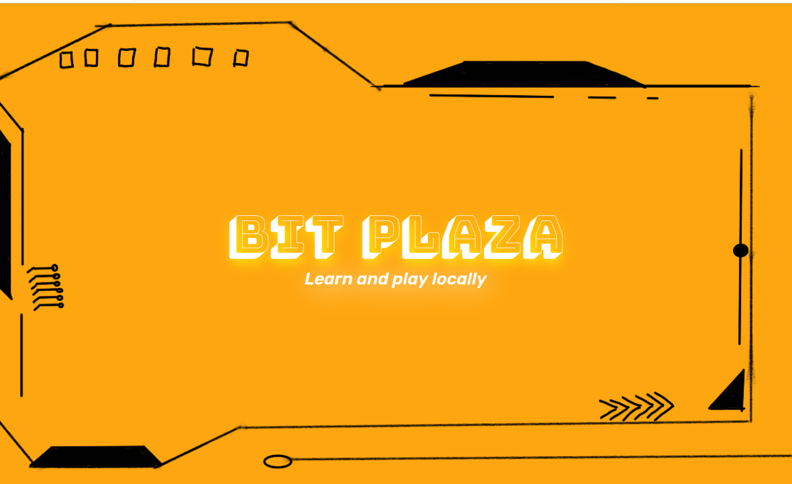

# BitPlaza
BitPlaza is an offline computer science e-learning application for desktop/PC, aimed at students and beginners. Learn and play locally.

## Credits
Designed and Developed by Riya Hal, Shikha Kumari, Dedeepya, Rakshitha Gowda
Artwork by Rakshitha Gowda

## Steps for Execution
1. Install the Expo CLI by running this command in your Bash/Terminal: npm install -g expo-cli.

2. Navigate to your desired location where you want your Expo project folder to be created in Bash/Terminal. If you want the folder to be created on your desktop, run the command cd ~/Desktop.

3. Create a new Expo project by running the following command: npx create-expo-app ProjectName --template expo-template-blank-typescript. Replace ProjectName with the name of your project.

4. A project folder will be created in the specified location. Download the code files in this repository and add them to the project folder in the necessary locations. You will need to replace some existing files and folders with the given files and folders.

5. In Bash/Terminal, run npm install to install the node_modules folder.

6. Run your application by running npx expo start.

7. Enter 'w' in Bash/Terminal to open the web-based version of the application in your computer's browser.
